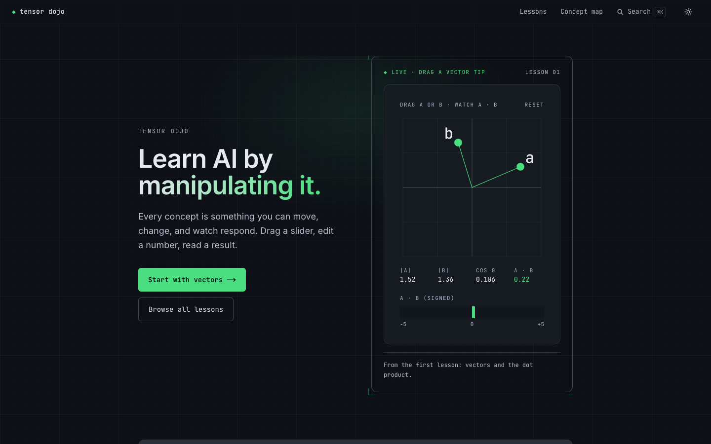
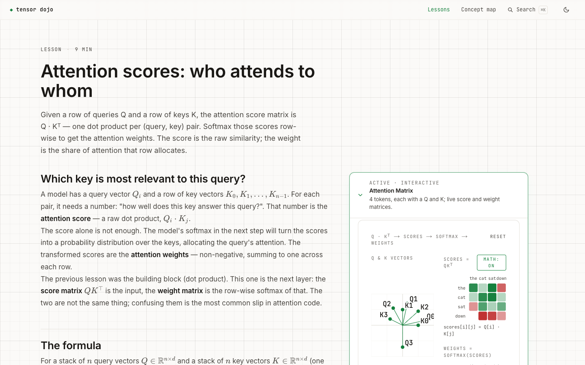
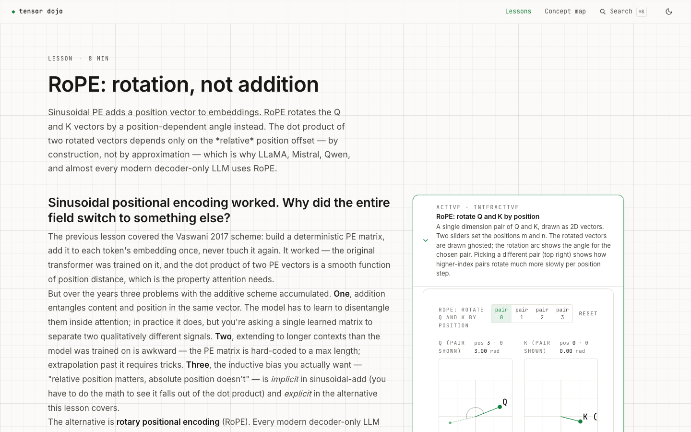
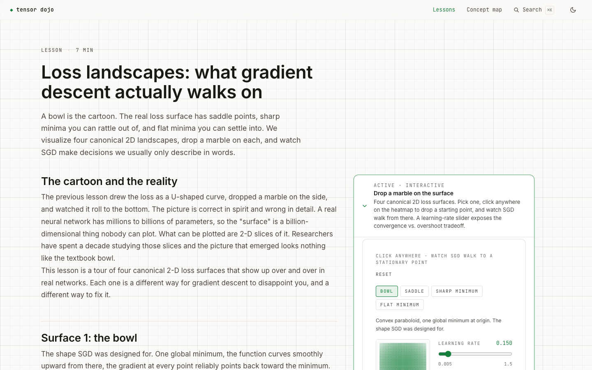
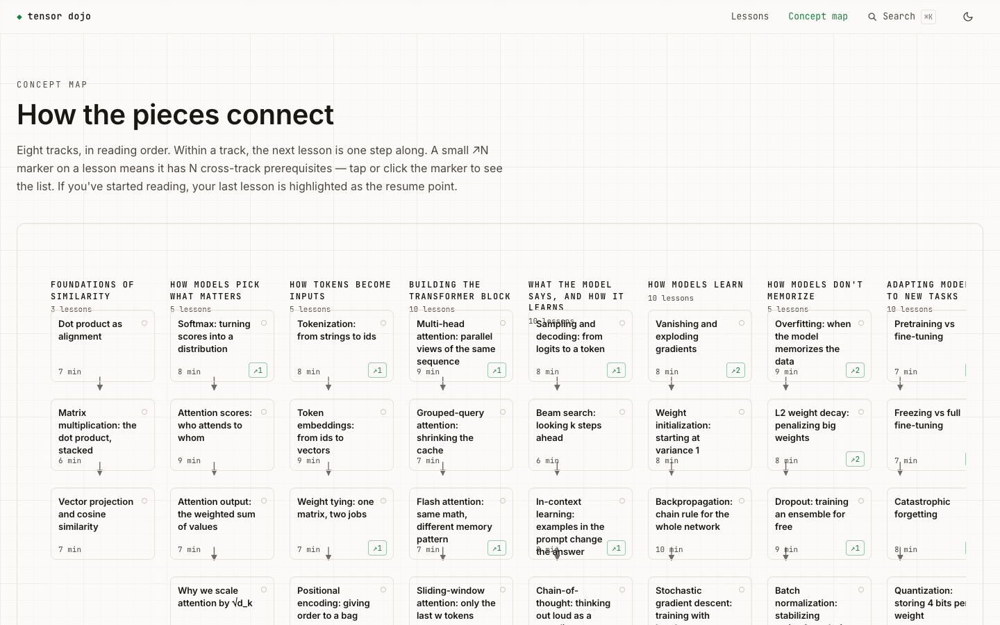

<p align="center">
  
</p>

# TensorDojo

> **Learn how LLMs work by manipulating them.** Every concept is something you
> can drag, edit, or step through — with the math underneath you can read.

[](https://tensordojo.vercel.app/lessons)
[](#stack)


**[→ Open it: tensordojo.vercel.app](https://tensordojo.vercel.app)**

<p align="center">
  
</p>

58 interactive lessons across 8 tracks. From the dot product at lesson 1
through attention, the transformer block, training mechanics, regularization,
RAG, LoRA, DPO, and distillation. No videos. No backend. Every figure is
React + SVG you can move; every math module is backed by tests.

---

## Why this exists

Most LLM explainers are write-ups with diagrams. You read them. They make
sense. You close the tab and a week later the intuition is gone.

TensorDojo replaces every diagram with a sim you can grab. The dot-product
lesson hands you two 2D vectors and a live readout; you drag one of them
and *feel* what alignment means. The attention lesson hands you four
queries and four keys on the same plane; rotating one changes the
softmax weight matrix in real time. The DPO lesson is a draggable point
on the loss surface, watching the bracketed term move.

The pitch in one line: **the math isn't behind a wall of LaTeX, it's the
thing you're manipulating**.

| Attention scores | RoPE | Loss landscapes |
|---|---|---|
|  |  |  |
| Rotate a query vector, watch the row of the weight matrix sharpen or flatten. | Drag the position sliders; the rotated dot product depends only on m − n. | Click anywhere on the surface and watch SGD walk to a stationary point. |

## What's inside

Eight tracks, in reading order:

| # | Track | Lessons | Sample of what you can move |
|---|-------|:-------:|------------------------------|
| 1 | Foundations of similarity | 3 | Vector tips, matmul cells, projection lines |
| 2 | How models pick what matters | 5 | Softmax temperature, attention Q/K vectors, causal mask toggle |
| 3 | How tokens become inputs | 5 | BPE merges, embedding-space tokens, RoPE pair-rotation |
| 4 | Building the transformer block | 10 | Multi-head rotations, GQA group factor, flash-attn tiles, sliding window |
| 5 | What the model says, and how it learns | 10 | Sampling strategy, beam frontier, ICL shot count, CoT step, RAG retriever |
| 6 | How models learn | 10 | Gradient descent η, optimizer race, LR schedule, mixed-precision underflow, checkpoint anchors |
| 7 | How models don't memorize | 5 | Polynomial degree, weight decay λ, dropout p, BN batch stats |
| 8 | Adapting models to new tasks | 10 | Layer freeze toggle, quantization bits, LoRA rank, QLoRA memory bars, DPO loss surface |

Total: **58 lessons, 84 lesson-specific sims, ~10 hours of reading**.

<details>
<summary><strong>Full lesson list (58, in reading order)</strong></summary>

**Foundations of similarity**
1. Dot product as alignment
2. Matrix multiplication: the dot product, stacked
3. Vector projection and cosine similarity

**How models pick what matters**
4. Softmax: turning scores into a distribution
5. Attention scores: who attends to whom
6. Attention output: the weighted sum of values
7. Why we scale attention by √d_k
8. Causal masking: don't peek at the future

**How tokens become inputs**
9. Tokenization: from strings to ids
10. Token embeddings: from ids to vectors
11. Weight tying: one matrix, two jobs
12. Positional encoding: giving order to a bag
13. RoPE: rotation, not addition

**Building the transformer block**
14. Multi-head attention: parallel views of the same sequence
15. Grouped-query attention: shrinking the cache
16. Flash attention: same math, different memory pattern
17. Sliding-window attention: only the last w tokens
18. Residual connections + layer normalization
19. RMSNorm: layer norm without the mean
20. Activations: the bend that makes a network non-linear
21. Feed-forward network: per-token rewriting
22. Mixture of experts: more parameters at the same compute
23. The transformer block: putting it all together

**What the model says, and how it learns**
24. Sampling and decoding: from logits to a token
25. Beam search: looking k steps ahead
26. In-context learning: examples in the prompt change the answer
27. Chain-of-thought: thinking out loud as a sampling pattern
28. RAG: retrieve, then generate
29. KV cache: making inference fast
30. Speculative decoding: a small model drafts, the big one verifies
31. Cross-entropy: how the model knows it was wrong
32. Gradient descent: walking the loss downhill
33. Loss landscapes: what gradient descent actually walks on

**How models learn**
34. Vanishing and exploding gradients
35. Weight initialization: starting at variance 1
36. Backpropagation: chain rule for the whole network
37. Stochastic gradient descent: training with batches
38. Optimizers: SGD, momentum, Adam
39. Learning-rate schedules: how aggressively to step, over time
40. Mixed precision: bf16 for compute, fp32 for accumulate
41. Gradient checkpointing: throw activations away, recompute them
42. Training a tiny model, end to end
43. Scaling laws: how big should the model be?

**How models don't memorize**
44. Overfitting: when the model memorizes the data
45. L2 weight decay: penalizing big weights
46. Dropout: training an ensemble for free
47. Batch normalization: stabilizing activations during training
48. Early stopping + data augmentation: cheap regularization that just works

**Adapting models to new tasks**
49. Pretraining vs fine-tuning
50. Freezing vs full fine-tuning
51. Catastrophic forgetting
52. Quantization: storing 4 bits per weight
53. LoRA: low-rank adaptation
54. QLoRA: 4-bit base + LoRA on a single GPU
55. Evaluation: how the field measures models
56. Instruction tuning & RLHF intuition
57. DPO: skip the reward model
58. Distillation: small model learns from big model

</details>

The `/map` page shows the same eight tracks as columns of a single SVG
canvas. In-track arrows are short verticals; cross-track prerequisites
are dashed accent arcs. Your last-visited lesson is highlighted as the
resume point.

<p align="center">
  
</p>

## How to use it

- **Start at lesson 1** if you're new — the curriculum builds.
- **Cmd-K** (or **Ctrl-K**) opens a search palette from anywhere; jump to
  any of the 58 by title, summary, or track.
- **Concept map** (`/map`) shows the eight tracks as columns with cross-track
  prerequisite arcs; useful when you want to land on a specific topic and
  follow its dependencies backward.
- **Resume point** is highlighted on `/` and `/map` from `localStorage` —
  no account, no backend.
- **←/→** navigates prev/next within a lesson when no input is focused.

---

## How it's built

| Layer | Choice |
|-------|--------|
| Framework | Next.js 15 (App Router), TypeScript strict |
| Package manager | pnpm |
| Styling | Tailwind CSS, themed via CSS custom properties (`rgb(var(--token) / <alpha>)` channel pattern — same classes work in light + dark) |
| Content | MDX (`@next/mdx`); math via `remark-math` + `rehype-katex` |
| Figures | React + SVG. Zero charting libraries. |
| State | `useState` / `useReducer` only |
| Search | [cmdk](https://github.com/pacocoursey/cmdk), client-side index |
| Validation | `zod` validates lesson metadata at build time |
| Testing | Vitest, 591 tests across 52 files |
| Deploy | Vercel (static export, per-route OG cards via `ImageResponse`) |

**Bundle**: ~105 kB shared first-load JS. Heavy centerpiece sims
(BlockPipeline, TrainingEndToEnd, OptimizerRace, OverfittingExplorer,
BatchNormExplorer, EarlyStoppingAugmentationExplorer, SequentialTaskTrainer)
live in lazy chunks so an individual lesson route stays under ~150 kB.

## Quick start

```bash
pnpm install
pnpm dev          # http://localhost:3000
```

Production:

```bash
pnpm build
pnpm start
```

Tests, content lint, and the full quality gates:

```bash
pnpm test                    # vitest, math suites
pnpm lint:content            # zod-validated cross-reference check
pnpm build                   # strict TS, full static export, OG cards
```

Requires Node 18+ and pnpm 9+.

---

## Adding a new lesson

The pattern used for all 58 live lessons — no speculation.

<details>
<summary><strong>Step-by-step (6 steps)</strong></summary>

1. **Create the folder** `content/lessons/<slug>/` with three files:
   - `meta.ts` — exports a const with `slug`, `title`, `summary`,
     `minutes`, `order`. The `order` field is informational; the
     reading-order source of truth is the `TRACKS` array in
     `lib/lessons-meta.ts`.
   - `interactives.tsx` — exports `readonly InteractiveEntry[]`. Each
     entry has `id`, `title`, `description`, `Component`. The
     `Component` renders the figure (typically a wrapper around a
     primitive under `components/sim/primitives/`).
   - `lesson.mdx` — the article. Import `MathCode` and `Callout` from
     `@/components/lesson/*` at the top, then write the lesson:
     question heading → formula → centerpiece interactive → reading
     the result → secondary widget → recap. Use
     `<Callout targetInteractive="…">` to focus a figure from prose;
     use `<MathCode math="…" code={…} caption="…" />` for the
     side-by-side math+code block.

2. **Register the lesson** in three places:
   - `lib/lessons-meta.ts` — add an `import { meta as … } from
     '@/content/lessons/<slug>/meta'`, an entry in the `manifest`
     array, and slot the slug into the appropriate `TRACKS` track
     (which becomes its column on `/map` and its group on the home
     page).
   - `lib/lesson-manifest.ts` — add an import of the `interactives`
     and an entry in the manifest.
   - `lib/lessons.ts` — add a dynamic MDX loader for the slug so the
     lesson route can code-split it.

3. **If the lesson needs a new interactive primitive**
   (a custom slider, heatmap variant, etc.), add it under
   `components/sim/primitives/`. The existing primitives
   (`VectorCanvas`, `Heatmap`, `BarChart`, `Slider`, `NumberInput`,
   `LossLandscape`, `SimFrame`) are themed via the same token system;
   any new primitive must use the tokens, not hardcoded colors.

4. **If the lesson needs new math**, put it in
   `lib/math/<name>.ts` with `lib/math/<name>.test.ts` next to it.
   Cover the boundary cases (zero vectors, dimension mismatches, NaN
   propagation) — these tests are the lesson's defense against silent
   numerical breakage.

5. **Add the concept** to `content/concepts/graph.yaml`: a node, the
   incoming edges from its prerequisite concepts, and a
   `lesson-concept` node tagged with the lesson slug. The map
   inference walks these edges to figure out which lessons feed
   which.

6. **Run the gates**: `pnpm lint:content && pnpm test && pnpm build`.
   `lint:content` rejects cycles and dangling edges; the build
   regenerates the per-lesson OG card automatically.

</details>

## Project structure

```
TensorDojo/
├── app/
│   ├── layout.tsx                       # root layout, inline no-flash theme, Cmd-K palette
│   ├── page.tsx                         # landing
│   ├── opengraph-image.tsx              # root OG card
│   ├── lessons/
│   │   ├── page.tsx                     # full lesson directory
│   │   └── [slug]/
│   │       ├── page.tsx                 # dynamic SSG route, MDX code-split per slug
│   │       └── opengraph-image.tsx      # per-lesson OG card
│   └── map/page.tsx                     # concept map
├── components/
│   ├── lesson/                          # LessonShell, Workbench, Callout, MathCode, PrevNext, …
│   ├── sim/                             # 84 lesson-specific composers
│   │   └── primitives/                  # VectorCanvas, Heatmap, BarChart, Slider, NumberInput, SimFrame, LossLandscape
│   ├── search/SearchPalette.tsx         # Cmd-K palette (cmdk)
│   ├── concept-graph/                   # ConceptGraphView (SVG 2D map)
│   ├── home/                            # landing-page composition (hero, tracks, FAQ, footer)
│   └── theme/                           # TopNav, ThemeToggle
├── content/
│   ├── lessons/<slug>/                  # meta.ts + interactives.tsx + lesson.mdx
│   └── concepts/graph.yaml              # prerequisite DAG
├── lib/
│   ├── math/                            # 53 modules with co-located tests (591 tests total)
│   ├── content/                         # YAML loaders + zod schemas + map-data
│   ├── progress/                        # visits.ts (localStorage tracking)
│   ├── theme/                           # use-theme hook
│   ├── lessons-meta.ts                  # client-safe manifest + TRACKS + trackForSlug
│   ├── lessons.ts                       # server-side registry + MDX loaders
│   └── lesson-manifest.ts               # interactives manifest
└── scripts/
    ├── lint-content.ts                  # zod-validated cross-reference check
    └── _verify.mjs                      # headless render-error sweep (puppeteer)
```

## Design system

Themed via CSS custom properties on `:root` (light, default) and
`:root.dark` (override). Tailwind reads them via the channel pattern:
each token is stored as a bare `R G B` triplet, then composed in the
config as `rgb(var(--token) / <alpha-value>)`. Existing classes
(`bg-bg`, `text-ink`, `border-border`, `bg-bg/40`) work in both themes
without per-component overrides.

**One accent, one rule.** The accent (teal) is reserved for the things
the reader can move (sliders, knobs, dominant bars) and the things the
reader is navigating to (resume node, hover/focus states). Static chrome
— headings, body text, borders, code fences — never uses it.

**Typography**: Inter (UI prose) + JetBrains Mono (numbers, labels,
code) via `next/font`.

**Math**: KaTeX via `remark-math` + `rehype-katex`. Display mode for
the headline equation of a section, inline for everything else.

## Status

The curriculum is complete enough to launch. What's still ahead:

- Per-lesson quizzes (a `<Check>` MDX component, ungated)
- Capstone notebooks: take the toy sims into real Hugging Face / PyTorch
- Custom domain
- Analytics + an actual launch post

Issues and PRs welcome.

## License

MIT.
